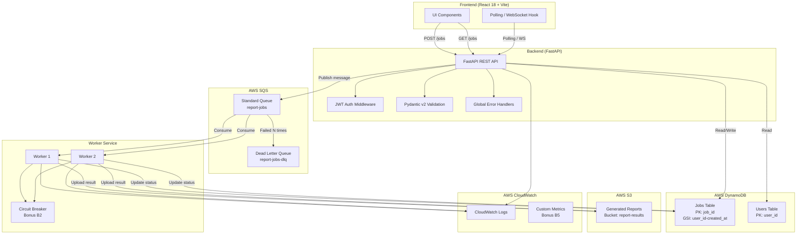

# TECHNICAL_DOCS.md — Sistema de Procesamiento Asíncrono de Reportes

> **Documento vivo**: Se actualiza conforme avanza la implementación. Cada sección debe reflejar el estado REAL del código, no intenciones futuras.
>
> **Generado con IA**: GitHub Copilot (Claude). Ver [AI_WORKFLOW.md](AI_WORKFLOW.md) para evidencia de uso.

---

## 1. Diagrama de Arquitectura



### Flujo de Datos Completo

```
1. Usuario completa formulario en React (report_type, date_range, format)
2. Frontend envía POST /api/jobs con JWT en header Authorization
3. FastAPI valida payload (Pydantic v2), verifica JWT, crea registro en DynamoDB con status=PENDING
4. FastAPI publica mensaje a SQS con { job_id, report_type, parameters, user_id }
5. FastAPI responde inmediatamente: { job_id, status: 'PENDING' }
6. Worker(s) hacen polling a SQS, reciben mensaje
7. Worker actualiza status=PROCESSING en DynamoDB
8. Worker ejecuta procesamiento (simulado: sleep 5-30s + datos dummy)
9. Worker genera resultado, lo sube a S3, actualiza status=COMPLETED + result_url en DynamoDB
10. Si falla: status=FAILED, mensaje vuelve a cola (visibility timeout) → tras N fallos → DLQ
11. Frontend detecta cambio de estado via polling (GET /api/jobs) y actualiza UI
```

---

## 2. Servicios AWS Utilizados

| Servicio | Propósito | Por qué se eligió | Alternativas descartadas |
|----------|-----------|-------------------|--------------------------|
| **SQS (Standard Queue)** | Cola de mensajes para desacoplar API de workers | Fully managed, 1M requests/mes gratis, integración nativa con DLQ, visibility timeout para reintentos, ideal para job queues | SNS (fan-out, no job queue), RabbitMQ en EC2 (gestión manual), EventBridge (para eventos, no jobs) |
| **SQS (DLQ)** | Capturar mensajes que fallan repetidamente | Configuración nativa de SQS, sin código adicional, solo `maxReceiveCount` | Tabla DynamoDB separada para fallos (más código, menos integrado) |
| **DynamoDB** | Persistencia de estado de jobs y usuarios | Serverless, no requiere gestión, free tier 25GB + 25 WCU/RCU, queries eficientes por GSI, modelo key-value ideal para jobs | RDS PostgreSQL (requiere instancia 24/7, más caro), Aurora Serverless (más complejo de configurar) |
| **S3** | Almacenamiento de reportes generados | Barato, escalable, URLs pre-firmadas para descarga segura, integración natural con frontend via CloudFront | EFS (overkill para archivos estáticos), DynamoDB (límite 400KB por item) |
| **ECS Fargate** | Compute para API y Workers | Containerizado (Docker requerido por la prueba), sin gestión de servidores, escala independiente API/Workers, sin límite de tiempo de ejecución | Lambda (límite 15 min, cold starts), EC2 (gestión manual), App Runner (menos control sobre networking) |
| **CloudFront + S3** | Hosting del frontend React | Estático, barato, CDN global, HTTPS automático con ACM | Amplify (más opaco), ECS para servir estáticos (overkill) |
| **CloudWatch** | Logs y monitoreo | Incluido, integración nativa con ECS/SQS, métricas custom para Bonus B5 | Datadog/NewRelic (costo adicional, overkill para prueba) |
| **ECR** | Registro de imágenes Docker | Integración nativa con ECS, 500MB gratis, necesario para CI/CD | Docker Hub (límite de pulls, latencia) |
| **ALB** | Load Balancer para API | Distribuye tráfico a tareas ECS, health checks, HTTPS termination | API Gateway (costo por request, más complejo para containers) |

---

## 3. Decisiones de Diseño

### 3.1 DynamoDB sobre PostgreSQL
**Trade-off**: Sacrificamos joins y SQL por simplicidad operativa y costo cero.
- El modelo de datos es simple (key-value con pocos GSIs)
- No se requieren queries complejas con joins
- Las consultas principales son: get by job_id, list by user_id (ordenado por fecha)
- GSI: `user_id` (PK) + `created_at` (SK) para paginación eficiente

### 3.2 SQS Standard sobre FIFO
**Trade-off**: Sacrificamos orden estricto por throughput y simplicidad.
- No se requiere orden de procesamiento (cada job es independiente)
- Standard Queue tiene throughput ilimitado
- FIFO tiene límite de 3000 msg/s y es más caro
- At-least-once delivery es aceptable — el worker es idempotente

### 3.3 ECS Fargate sobre Lambda
**Trade-off**: Mayor costo base pero sin límites de ejecución.
- El procesamiento simulado puede tardar hasta 30s (dentro del límite de Lambda)
- PERO: en producción real, reportes pueden tardar minutos
- Fargate permite workers de larga duración sin límite de 15 min
- Docker ya es requerido por la prueba, Fargate lo aprovecha directamente

### 3.4 Polling sobre WebSockets (base) — WebSockets como Bonus B3
**Trade-off**: Polling es más simple de implementar pero menos eficiente.
- Base: Polling cada 3-5s es suficiente para la demo
- Bonus B3: WebSockets para notificaciones push reales
- Polling es más resiliente (stateless, funciona a través de load balancers)

### 3.5 Monorepo con separación clara
- Backend y frontend en el mismo repo pero con Dockerfiles independientes
- Facilita CI/CD (un solo pipeline)
- Facilita evaluación (todo en un lugar)
- Estructura sigue la sugerencia del challenge

### 3.6 Manejo centralizado de errores
- Middleware global de FastAPI con `@app.exception_handler`
- Excepciones custom heredan de base exception
- Respuestas de error consistentes: `{ detail, error_code, timestamp }`
- NO try/except dispersos — solo en el punto de uso de recursos externos

---

## 4. Guía de Setup Local (con LocalStack)

### Prerrequisitos
- Docker Desktop instalado y corriendo
- Docker Compose v2+
- Git
- Node.js 18+ (solo si quieres desarrollo frontend fuera de Docker)
- Python 3.11+ (solo si quieres desarrollo backend fuera de Docker)

### Pasos para levantar desde cero

```bash
# 1. Clonar el repositorio
git clone https://github.com/joangel/joangel-prosperas-challenge.git
cd joangel-prosperas-challenge

# 2. Copiar variables de entorno
cp .env.example .env

# 3. Levantar todo (LocalStack + Backend + Frontend + Worker)
docker compose -f local/docker-compose.yml up --build

# 4. Esperar a que LocalStack esté listo (health check automático)
# Los recursos AWS se crean automáticamente via local/localstack/init-aws.sh

# 5. La aplicación estará disponible en:
#    - Frontend: http://localhost:3000
#    - Backend API: http://localhost:8000
#    - API Docs (Swagger): http://localhost:8000/docs
#    - LocalStack: http://localhost:4566
```

### Verificar que todo funciona

```bash
# Verificar servicios de LocalStack
aws --endpoint-url=http://localhost:4566 sqs list-queues
aws --endpoint-url=http://localhost:4566 dynamodb list-tables

# Crear un usuario de prueba
curl -X POST http://localhost:8000/api/auth/register \
  -H "Content-Type: application/json" \
  -d '{"username": "testuser", "password": "testpass123"}'

# Login y obtener token
TOKEN=$(curl -s -X POST http://localhost:8000/api/auth/login \
  -H "Content-Type: application/json" \
  -d '{"username": "testuser", "password": "testpass123"}' | jq -r '.token')

# Crear un job
curl -X POST http://localhost:8000/api/jobs \
  -H "Authorization: Bearer $TOKEN" \
  -H "Content-Type: application/json" \
  -d '{"report_type": "sales", "date_range": {"start": "2025-01-01", "end": "2025-12-31"}, "format": "pdf"}'

# Listar jobs
curl http://localhost:8000/api/jobs \
  -H "Authorization: Bearer $TOKEN"
```

---

## 5. Guía de Despliegue (CI/CD Pipeline)

### Pipeline GitHub Actions: `.github/workflows/deploy.yml`

```
Trigger: Push a rama `main`

Steps:
┌─────────────────────────────────────────────────┐
│ 1. CHECKOUT                                      │
│    - actions/checkout@v4                         │
├─────────────────────────────────────────────────┤
│ 2. TEST                                          │
│    - Setup Python 3.11                           │
│    - Install dependencies                        │
│    - Run pytest (backend)                        │
│    - Run lint (ruff)                             │
├─────────────────────────────────────────────────┤
│ 3. BUILD                                         │
│    - Build Docker images (backend, frontend)     │
│    - Push to ECR                                 │
├─────────────────────────────────────────────────┤
│ 4. INFRASTRUCTURE                                │
│    - Terraform init/plan/apply                   │
│    - Crear/actualizar recursos AWS               │
├─────────────────────────────────────────────────┤
│ 5. DEPLOY                                        │
│    - Update ECS services (API + Worker)          │
│    - Deploy frontend to S3 + invalidate CF cache │
├─────────────────────────────────────────────────┤
│ 6. VERIFY                                        │
│    - Health check a URL de producción            │
│    - Smoke test básico                           │
└─────────────────────────────────────────────────┘
```

### Secrets de GitHub (NUNCA en código)
- `AWS_ACCESS_KEY_ID` — Credenciales de deploy
- `AWS_SECRET_ACCESS_KEY` — Credenciales de deploy
- `JWT_SECRET_KEY` — Secret para tokens JWT en producción

### Por qué se diseñó así
- **Test primero**: No hacer deploy si los tests fallan
- **Build con Docker**: Misma imagen en CI y producción, sin "works on my machine"
- **IaC en el pipeline**: Infraestructura siempre sincronizada con el código
- **Verificación post-deploy**: Confirmar que la app está viva después del deploy

---

## 6. Variables de Entorno

| Variable | Descripción | Ejemplo Dev | Ejemplo Prod |
|----------|-------------|-------------|--------------|
| `APP_ENV` | Ambiente actual | `development` | `production` |
| `APP_PORT` | Puerto del backend | `8000` | `8000` |
| `FRONTEND_URL` | URL del frontend (CORS) | `http://localhost:3000` | `https://app.example.com` |
| `AWS_REGION` | Región AWS | `us-east-1` | `us-east-1` |
| `AWS_ACCESS_KEY_ID` | Credencial AWS | `test` | *(en GitHub Secrets)* |
| `AWS_SECRET_ACCESS_KEY` | Credencial AWS | `test` | *(en GitHub Secrets)* |
| `AWS_ENDPOINT_URL` | Endpoint LocalStack | `http://localstack:4566` | *(no se usa)* |
| `SQS_QUEUE_NAME` | Nombre de cola SQS | `report-jobs` | `report-jobs` |
| `SQS_DLQ_NAME` | Nombre de DLQ | `report-jobs-dlq` | `report-jobs-dlq` |
| `SQS_MAX_RECEIVE_COUNT` | Reintentos antes de DLQ | `3` | `3` |
| `DYNAMODB_TABLE_NAME` | Tabla de jobs | `jobs` | `jobs` |
| `DYNAMODB_USERS_TABLE` | Tabla de usuarios | `users` | `users` |
| `JWT_SECRET_KEY` | Secret para firmar JWTs | `change-me-in-production` | *(en GitHub Secrets)* |
| `JWT_ALGORITHM` | Algoritmo JWT | `HS256` | `HS256` |
| `JWT_EXPIRATION_MINUTES` | Expiración del token | `60` | `60` |
| `WORKER_CONCURRENCY` | Workers paralelos | `2` | `2` |
| `WORKER_POLL_INTERVAL` | Segundos entre polls | `5` | `5` |
| `S3_BUCKET_NAME` | Bucket para reportes | `report-results` | `report-results` |

---

## 7. Tests

### Ejecutar tests

```bash
# Backend — todos
cd backend && pytest tests/ -v

# Backend — con cobertura
cd backend && pytest tests/ -v --cov=app --cov-report=term-missing --cov-report=html

# Backend — solo unitarios
cd backend && pytest tests/unit/ -v

# Backend — solo integración (requiere LocalStack corriendo)
cd backend && pytest tests/integration/ -v

# Frontend
cd frontend && npm test

# Frontend — con cobertura
cd frontend && npm test -- --coverage
```

### Qué cubre cada suite

| Suite | Qué prueba | Archivos |
|-------|-----------|----------|
| `tests/unit/test_models.py` | Validación de schemas Pydantic, serialización de modelos | Schemas de Job, User |
| `tests/unit/test_services.py` | Lógica de negocio sin dependencias externas | job_service, queue_service (mockeado) |
| `tests/unit/test_worker.py` | Procesamiento del worker, manejo de fallos | processor, circuit_breaker |
| `tests/integration/test_api.py` | Endpoints completos con BD y cola reales (LocalStack) | POST/GET /jobs, auth flows |
| `tests/integration/test_worker.py` | Worker consumiendo de SQS real (LocalStack) | End-to-end del pipeline |
| `frontend/src/**/*.test.tsx` | Renderizado de componentes, hooks, interacción | JobForm, JobList, useJobs |

### Bonus B6 — Tests avanzados (cobertura >= 70%)
- [ ] Unit test del worker processor
- [ ] Integration test de POST /jobs → SQS → Worker → DynamoDB
- [ ] Test que simula fallo de procesamiento y verifica DLQ
- [ ] Cobertura total >= 70%

---

## 8. Estructura del Repositorio

> Ver sección completa en [SKILL.md](SKILL.md) → "Mapa del Repositorio"

La estructura sigue la recomendación del challenge con ajustes para clean architecture:

| Directorio | Propósito |
|------------|-----------|
| `backend/app/api/` | Routers FastAPI — endpoints HTTP |
| `backend/app/core/` | Config, security (JWT), DB connection, error handlers |
| `backend/app/models/` | Pydantic schemas + modelos de datos |
| `backend/app/services/` | Lógica de negocio — publicar a cola, gestionar jobs |
| `backend/app/worker/` | Consumer SQS + processor de jobs |
| `backend/tests/` | Tests unitarios e integración |
| `frontend/src/components/` | Componentes React (formulario, lista, badges) |
| `frontend/src/hooks/` | Custom hooks (useJobs, useAuth) |
| `frontend/src/services/` | API client con auth headers |
| `infra/` | Terraform/CDK para recursos AWS de producción |
| `local/` | Docker Compose + LocalStack para desarrollo |
| `scripts/` | Scripts de utilidad (init-db, seed, deploy) |
| `.github/workflows/` | Pipeline CI/CD GitHub Actions |

---

## 9. Bonus Implementados

> Actualizar esta sección conforme se implementen los bonus.

| Bonus | Estado | Notas |
|-------|--------|-------|
| B1 — Prioridad de mensajes | ⬜ Pendiente | Dos colas SQS (alta/estándar), routing en API |
| B2 — Circuit Breaker | ⬜ Pendiente | Patrón en worker, estado open/closed/half-open |
| B3 — Notificaciones tiempo real | ⬜ Pendiente | WebSockets con FastAPI |
| B4 — Retry con back-off exponencial | ⬜ Pendiente | Espera exponencial en worker antes de retry |
| B5 — Observabilidad | ⬜ Pendiente | Structured logging, CloudWatch metrics, /health |
| B6 — Tests avanzados | ⬜ Pendiente | Cobertura >= 70%, test de fallo simulado |
