# TECHNICAL_DOCS.md — Sistema de Procesamiento Asíncrono de Reportes

> **Documento vivo**: Se actualiza conforme avanza la implementación. Cada sección refleja el estado real del código.
>
> **Generado con IA**: GitHub Copilot (Claude). Ver [AI_WORKFLOW.md](AI_WORKFLOW.md) para evidencia de uso.

---

## Índice

1. [Diagrama de Arquitectura](#1-diagrama-de-arquitectura)
2. [Flujo de Datos](#2-flujo-de-datos)
3. [Modelo de Datos](#3-modelo-de-datos)
4. [API REST — Endpoints](#4-api-rest--endpoints)
5. [Servicios AWS Utilizados](#5-servicios-aws-utilizados)
6. [Decisiones de Diseño](#6-decisiones-de-diseño)
7. [Guía de Setup Local (LocalStack)](#7-guía-de-setup-local-localstack)
8. [Guía de Despliegue (CI/CD)](#8-guía-de-despliegue-cicd)
9. [Variables de Entorno](#9-variables-de-entorno)
10. [Tests](#10-tests)
11. [Estructura del Repositorio](#11-estructura-del-repositorio)
12. [Bonus Implementados](#12-bonus-implementados)

---

## 1. Diagrama de Arquitectura

### 1.1 Vista General del Sistema

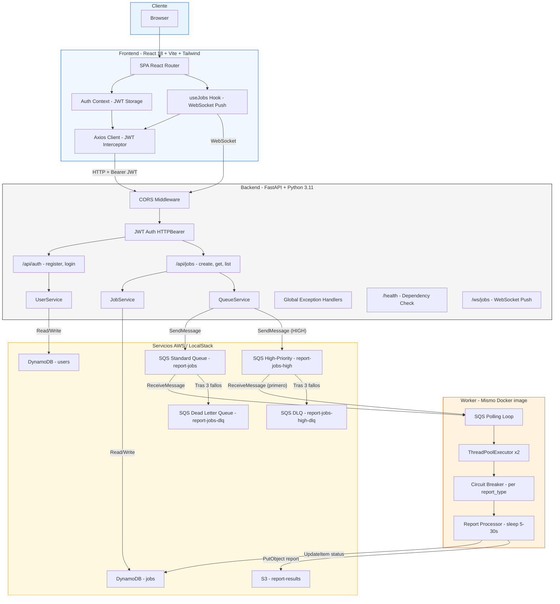

### 1.2 Arquitectura de Despliegue en AWS

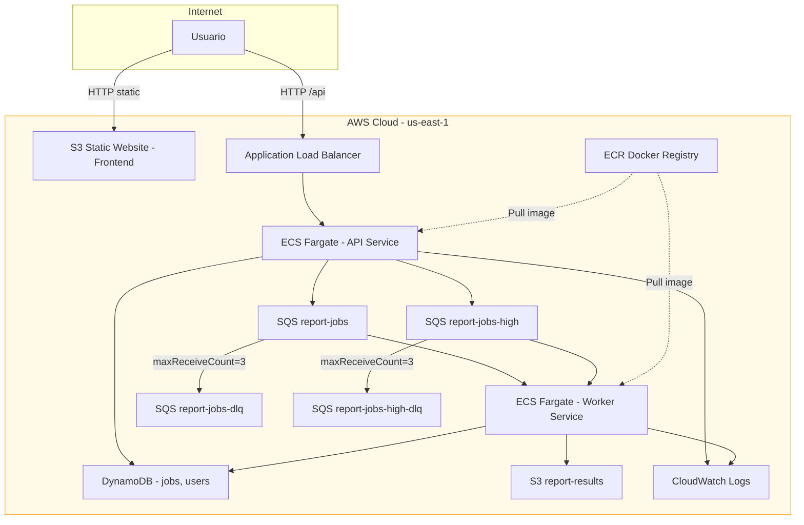

---

## 2. Flujo de Datos

### 2.1 Flujo Completo: Crear y Procesar un Reporte

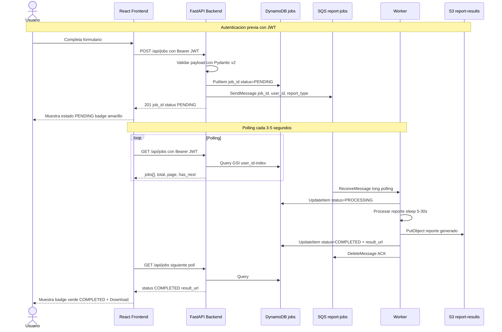

### 2.2 Flujo de Errores y Dead Letter Queue

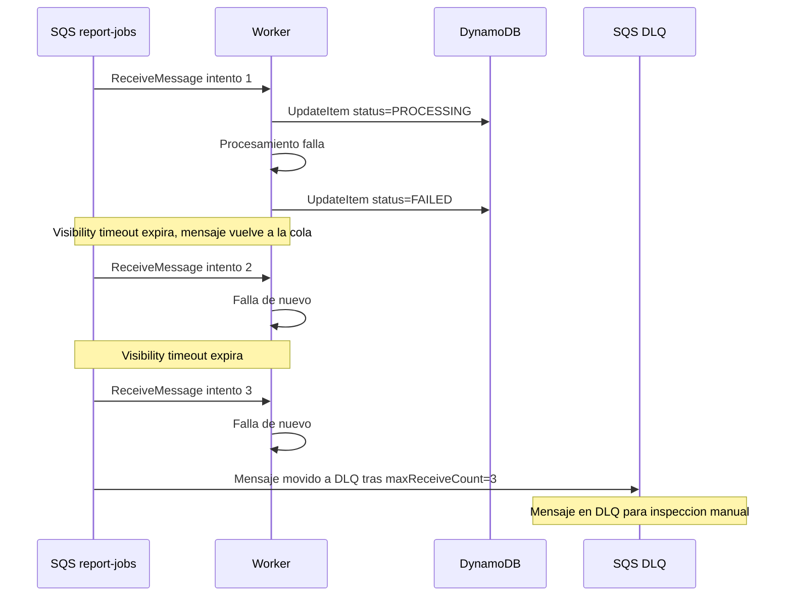

### 2.3 Flujo de Autenticación

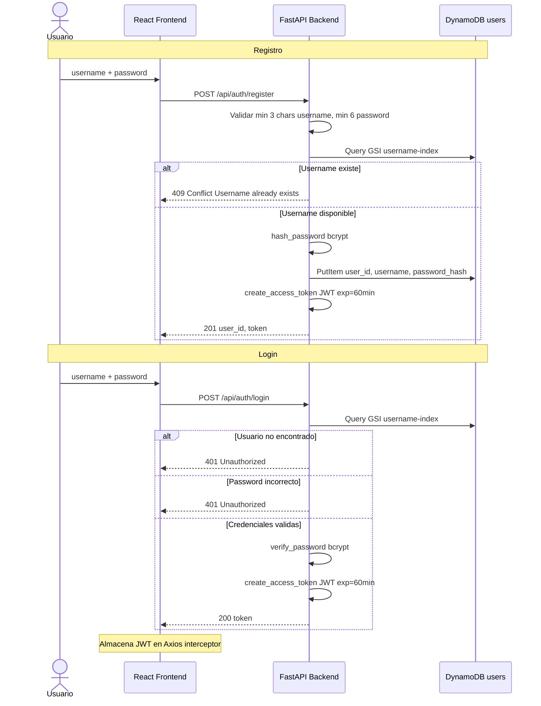

---

## 3. Modelo de Datos

### 3.1 Diagrama Entidad-Relación

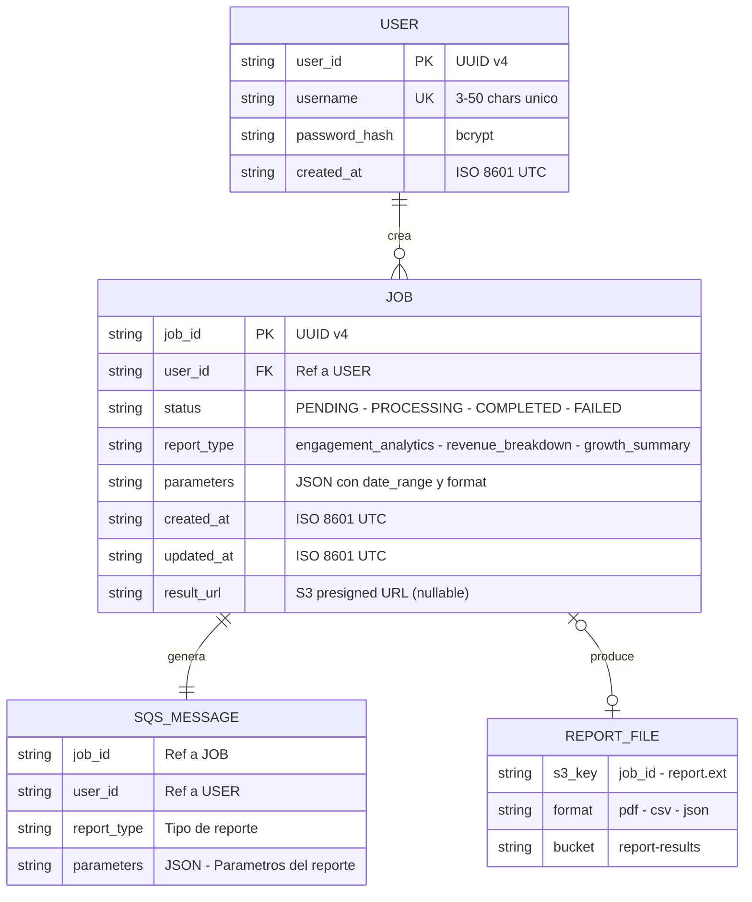

### 3.2 DynamoDB — Tablas e Índices

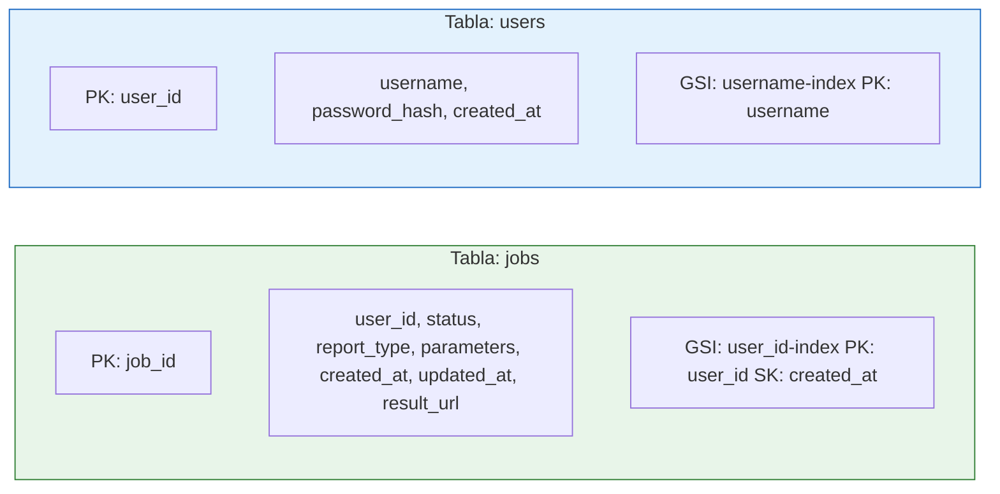

### 3.3 Ciclo de Estados de un Job

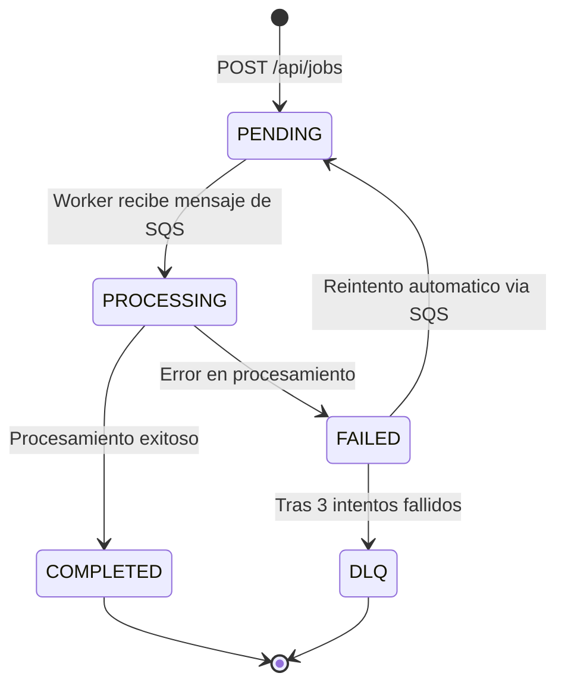

| Estado | Badge | Color | Accion UI |
|--------|-------|-------|-----------|
| **PENDING** | Amber | `bg-amber-500/10` | Cancel |
| **PROCESSING** | Blue + progress bar | `bg-secondary-container` | View Log |
| **COMPLETED** | Green | `bg-emerald-500/10` | Download |
| **FAILED** | Red | `bg-error-container` | Retry |

---

## 4. API REST — Endpoints

### 4.1 Mapa de Endpoints

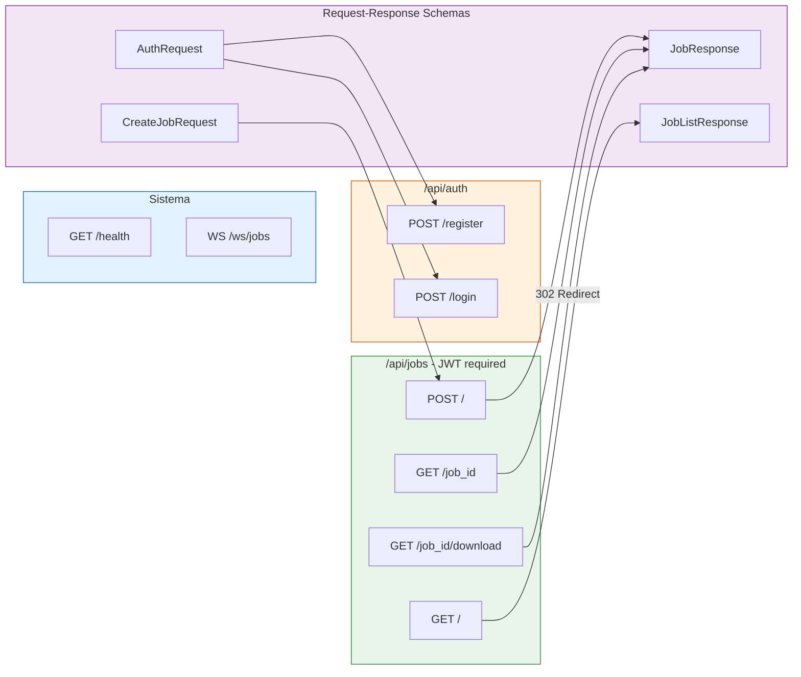

### 4.2 Detalle de Endpoints

| Método | Ruta | Auth | Request Body | Query Params | Response | Códigos |
|--------|------|------|--------------|--------------|----------|---------|
| `POST` | `/api/auth/register` | No | `{ username, password }` | — | `{ user_id, token }` | 201, 409, 422 |
| `POST` | `/api/auth/login` | No | `{ username, password }` | — | `{ token }` | 200, 401, 422 |
| `POST` | `/api/jobs` | JWT | `{ report_type, date_range, format }` | — | `{ job_id, status }` | 201, 401, 422 |
| `GET` | `/api/jobs/{job_id}` | JWT | — | — | `JobResponse` | 200, 401, 404 |
| `GET` | `/api/jobs` | JWT | — | `page`, `per_page` | `JobListResponse` | 200, 401 |
| `GET` | `/api/jobs/{job_id}/download` | JWT | — | — | Redirect 302 a URL pre-firmada S3 | 302, 401, 404 |
| `GET` | `/health` | No | — | — | `{ status, dependencies, timestamp }` | 200 |
| `WS` | `/ws/jobs?token=JWT` | JWT (query) | — | `token` | Push de actualizaciones de jobs | — |

**Valores válidos:**
- `report_type`: `engagement_analytics`, `revenue_breakdown`, `growth_summary`
- `format`: `pdf`, `csv`, `json`
- `page`: entero ≥ 1 (default: 1)
- `per_page`: entero 1–100 (default: 20)

---

## 5. Servicios AWS Utilizados

| Servicio | Propósito | Por qué se eligió | Alternativas descartadas |
|----------|-----------|-------------------|--------------------------|
| **SQS (Standard Queue)** | Cola de mensajes para desacoplar API de Workers | Fully managed, 1M requests/mes gratis, integración nativa con DLQ, visibility timeout para reintentos automáticos, ideal para job queues | RabbitMQ en EC2 (gestión manual), SNS (fan-out, no es job queue), EventBridge (orientado a eventos, no a jobs) |
| **SQS (Dead Letter Queue)** | Capturar mensajes que fallan 3+ veces | Configuración declarativa de SQS (`maxReceiveCount`), sin código adicional, permite inspección manual | Tabla DynamoDB de fallos (más código, menos integrado, sin re-drive) |
| **DynamoDB** | Persistencia de jobs y usuarios | Serverless, 0 gestión, free tier 25 GB + 25 WCU/RCU, modelo key-value ideal para jobs, GSI para queries eficientes | RDS PostgreSQL (instancia 24/7, mayor costo), Aurora Serverless (más complejo de configurar para este scope) |
| **S3** | Almacenamiento de reportes generados | Barato, escalable, URLs pre-firmadas para descarga segura | EFS (overkill para archivos estáticos), DynamoDB (límite 400 KB por item) |
| **ECS Fargate** | Compute para API y Workers en containers | Containerizado (Docker requerido), sin gestión de servidores, escala API y Workers de forma independiente, sin límite de tiempo de ejecución | Lambda (límite 15 min, cold starts), EC2 (gestión manual de instancias), App Runner (menos control de networking) |
| **S3 Static Website** | Hosting del frontend React | Hosting de archivos estáticos sin servidor, bajo costo, SPA fallback con error document, integración con Terraform | Amplify (más opaco), ECS para estáticos (overkill), CloudFront (requiere verificación de cuenta adicional) |
| **ECR** | Registro de imágenes Docker | Integración nativa con ECS, 500 MB gratis, necesario para CI/CD | Docker Hub (rate limits, mayor latencia) |
| **ALB** | Load Balancer para la API | Health checks, HTTPS termination, distribución de tráfico a tareas ECS | API Gateway (costo por request, más complejo para containers) |
| **CloudWatch** | Logs y monitoreo | Incluido, integración nativa con ECS/SQS, soporte para métricas custom | Datadog/New Relic (costo adicional, overkill para esta prueba) |

---

## 6. Decisiones de Diseño

### 6.1 DynamoDB sobre PostgreSQL

**Trade-off**: Sacrificamos joins y SQL por simplicidad operativa y costo cero.

- El modelo de datos es simple: dos tablas key-value con pocos índices secundarios
- No se requieren queries con JOINs — cada job pertenece a un solo usuario
- Queries principales cubiertas por PK + GSI: `get_item(job_id)`, `query(user_id, sort by created_at)`
- Paginación server-side sobre el GSI `user_id-index` con `ScanIndexForward=False` (orden descendente)
- Free tier cubre el volumen de esta aplicación sin costo

### 6.2 SQS Standard sobre FIFO

**Trade-off**: Sacrificamos orden estricto por throughput y simplicidad.

- Cada job es independiente → no se requiere orden de procesamiento
- Standard Queue tiene throughput prácticamente ilimitado
- FIFO tiene límite de 3,000 msg/s por grupo y mayor costo
- At-least-once delivery es aceptable — actualizar status a PROCESSING/COMPLETED es idempotente (misma operación produce mismo resultado)

### 6.3 ECS Fargate sobre Lambda

**Trade-off**: Mayor costo base pero sin límites de ejecución.

- Docker ya es requisito del challenge → Fargate lo aprovecha directamente
- En producción real, reportes pueden tardar varios minutos (Fargate no tiene límite)
- La misma imagen Docker corre como API (uvicorn) o Worker (entrypoint diferente)
- Escalado independiente: más workers sin afectar la API

### 6.4 Polling sobre WebSockets

**Trade-off**: Mayor latencia de notificación pero arquitectura más simple.

- Polling cada 3–5 s es suficiente para el caso de uso (reportes tardan 5–30 s)
- Funciona naturalmente a través de load balancers (stateless)
- No requiere infraestructura de WebSocket (sticky sessions, Redis pub/sub)
- WebSockets queda como Bonus B3 opcional

### 6.5 Monorepo con Separación Clara

- Backend y frontend en carpetas independientes con Dockerfiles propios
- Un solo repositorio → un solo pipeline CI/CD → evaluación más simple
- Estructura respeta la sugerencia del challenge

### 6.6 Manejo Centralizado de Errores

- Jerarquía de excepciones custom: `AppException` → `NotFoundException`, `ConflictException`, `UnauthorizedException`, `ValidationException`
- Handlers globales registrados en FastAPI via `register_exception_handlers(app)`
- Respuestas consistentes: `{ "detail": "..." }` con HTTP status code apropiado
- Handler catch-all para excepciones no manejadas → 500 con mensaje genérico (sin leak de internals)
- NO try/except dispersos en el código — solo en boundaries con recursos externos (boto3, bcrypt)

### 6.7 Seguridad JWT

- Tokens firmados con HS256 usando `python-jose`
- Secret Key desde variable de entorno (`JWT_SECRET_KEY`), nunca hardcodeado
- Tokens incluyen `sub` (user_id), `exp`, `iat`, `jti` (UUID para unicidad)
- Expiración configurable (default: 60 minutos)
- Dependency injection de FastAPI: `get_current_user` extrae y valida el JWT automáticamente
- Passwords hasheados con bcrypt via `passlib`

---

## 7. Guía de Setup Local (LocalStack)

### Prerrequisitos

| Herramienta | Versión | Obligatorio | Nota |
|-------------|---------|:-----------:|------|
| Docker Desktop | v4+ | ✅ | Motor de containers |
| Docker Compose | v2+ | ✅ | Incluido en Docker Desktop |
| Git | 2.x+ | ✅ | Control de versiones |
| Python | 3.11+ | ⚠️ | Solo si desarrollas backend fuera de Docker |
| Node.js | 18+ | ⚠️ | Solo si desarrollas frontend fuera de Docker |
| AWS CLI | v2 | ⚠️ | Solo para verificaciones manuales |

### Pasos para levantar desde cero

```bash
# 1. Clonar el repositorio
git clone https://github.com/joangel/joangel-prosperas-challenge.git
cd joangel-prosperas-challenge

# 2. Copiar variables de entorno (NO modificar valores para desarrollo local)
cp .env.example .env

# 3. Levantar todo con un solo comando
docker compose -f local/docker-compose.yml up --build

# 4. Esperar a que todos los servicios estén healthy (~30s)
#    LocalStack init-aws.sh crea automáticamente:
#    - SQS: report-jobs + report-jobs-dlq (con redrive policy)
#    - DynamoDB: jobs (GSI: user_id-index) + users (GSI: username-index)
#    - S3: report-results

# 5. Abrir en el navegador:
#    Frontend:       http://localhost:3000
#    API Docs:       http://localhost:8000/docs
#    LocalStack:     http://localhost.localstack.cloud:4566
```

### Servicios Docker Compose

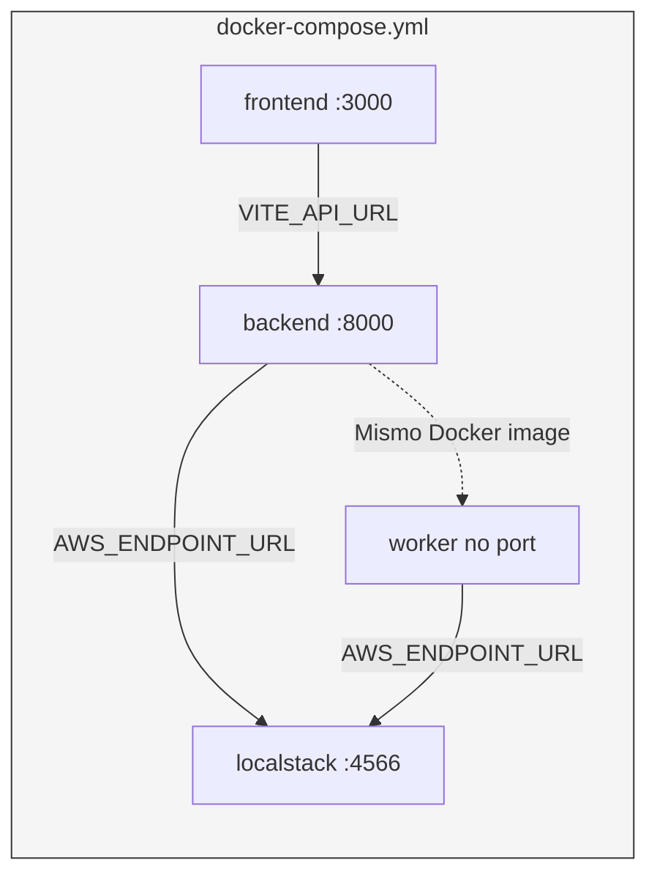

### Verificar que todo funciona

```bash
# Verificar recursos de LocalStack
aws --endpoint-url=http://localhost.localstack.cloud:4566 sqs list-queues
aws --endpoint-url=http://localhost.localstack.cloud:4566 dynamodb list-tables
aws --endpoint-url=http://localhost.localstack.cloud:4566 s3 ls

# Registrar un usuario de prueba
curl -X POST http://localhost:8000/api/auth/register \
  -H "Content-Type: application/json" \
  -d '{"username": "testuser", "password": "testpass123"}'

# Login y obtener JWT
TOKEN=$(curl -s -X POST http://localhost:8000/api/auth/login \
  -H "Content-Type: application/json" \
  -d '{"username": "testuser", "password": "testpass123"}' | jq -r '.token')

# Crear un job de reporte
curl -X POST http://localhost:8000/api/jobs \
  -H "Authorization: Bearer $TOKEN" \
  -H "Content-Type: application/json" \
  -d '{
    "report_type": "engagement_analytics",
    "date_range": {"start": "2025-01-01", "end": "2025-12-31"},
    "format": "pdf"
  }'

# Listar jobs (verificar que el status cambia via worker)
curl http://localhost:8000/api/jobs \
  -H "Authorization: Bearer $TOKEN"
```

### Comandos Make disponibles

```bash
make dev             # Levantar todo con Docker Compose
make dev-down        # Detener todos los servicios
make test            # Ejecutar todos los tests (backend + frontend)
make test-backend    # Ejecutar tests backend con cobertura
make test-frontend   # Ejecutar tests frontend
make lint            # Ejecutar linters (ruff + eslint)
make clean           # Limpiar artefactos de build
```

---

## 8. Guía de Despliegue (CI/CD)

### 8.1 Pipeline GitHub Actions

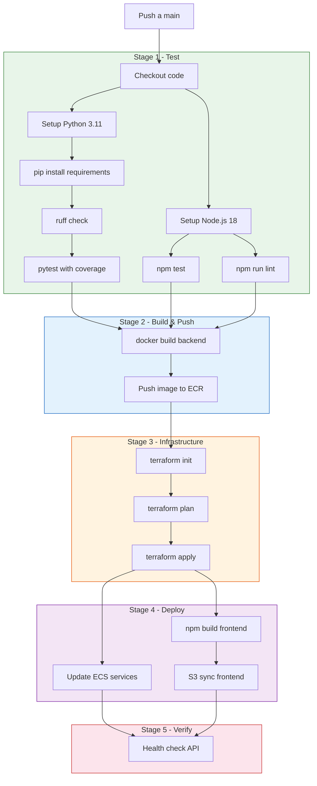

### 8.2 Secrets de GitHub (NUNCA en código)

| Secret | Propósito |
|--------|-----------|
| `AWS_ACCESS_KEY_ID` | Credenciales IAM para deploy |
| `AWS_SECRET_ACCESS_KEY` | Credenciales IAM para deploy |
| `JWT_SECRET_KEY` | Secret para firmar JWTs en producción |

### 8.3 Principios del Pipeline

- **Test primero**: No se hace deploy si algún test o lint falla — fail-fast garantizado
- **Build con Docker**: La misma imagen que pasa CI es la que corre en producción — elimina "works on my machine"
- **IaC en el pipeline**: Terraform `apply` en cada push asegura que la infra está siempre sincronizada con el código
- **Frontend dinámico**: El frontend se construye después de Terraform, usando la `api_url` del output como `VITE_API_URL` — sin secrets manuales para la URL de la API
- **Verificación post-deploy**: Health check automático confirma que la aplicación responde después del deploy

---

## 9. Variables de Entorno

Todas las variables se definen en `.env.example` con valores de desarrollo. En producción, los valores sensibles se manejan via GitHub Secrets y se inyectan como variables de entorno en ECS Task Definitions.

### 9.1 Tabla completa

| Variable | Descripción | Dev (LocalStack) | Producción |
|----------|-------------|:-----------------:|:----------:|
| **App** | | | |
| `APP_ENV` | Ambiente de ejecución. Controla nivel de logging y modo de errores | `development` | `production` |
| `APP_PORT` | Puerto donde escucha uvicorn | `8000` | `8000` |
| `FRONTEND_URL` | URL del frontend — usada para configurar CORS `allow_origins` | `http://localhost:3000` | `http://{s3-website-url}` |
| **AWS** | | | |
| `AWS_REGION` | Región AWS para todos los servicios | `us-east-1` | `us-east-1` |
| `AWS_ACCESS_KEY_ID` | Credencial AWS — en dev es placeholder para LocalStack | `test` | *GitHub Secret* |
| `AWS_SECRET_ACCESS_KEY` | Credencial AWS — en dev es placeholder para LocalStack | `test` | *GitHub Secret* |
| `AWS_ENDPOINT_URL` | Si está definido → usa LocalStack. Si es `None` → AWS real. Detectado en `config.py#is_local` | `http://localhost.localstack.cloud:4566` | *(no se define)* |
| **SQS** | | | |
| `SQS_QUEUE_NAME` | Nombre de la cola principal de jobs | `report-jobs` | `report-jobs` |
| `SQS_DLQ_NAME` | Nombre de la Dead Letter Queue | `report-jobs-dlq` | `report-jobs-dlq` |
| `SQS_HIGH_PRIORITY_QUEUE_NAME` | Nombre de la cola de alta prioridad para reportes financieros | `report-jobs-high` | `report-jobs-high` |
| `SQS_MAX_RECEIVE_COUNT` | Intentos antes de mover mensaje a DLQ. Configurado en redrive policy del init script | `3` | `3` |
| **DynamoDB** | | | |
| `DYNAMODB_JOBS_TABLE` | Nombre de la tabla de jobs | `jobs` | `jobs` |
| `DYNAMODB_USERS_TABLE` | Nombre de la tabla de usuarios | `users` | `users` |
| **JWT** | | | |
| `JWT_SECRET_KEY` | Clave secreta para firmar tokens JWT con HS256. **DEBE cambiarse en producción** | `change-me-in-production` | *GitHub Secret* |
| `JWT_ALGORITHM` | Algoritmo de firma JWT | `HS256` | `HS256` |
| `JWT_EXPIRATION_MINUTES` | Tiempo de vida del token en minutos | `60` | `60` |
| **Worker** | | | |
| `WORKER_CONCURRENCY` | Número de mensajes que el worker procesa en paralelo | `2` | `2` |
| `WORKER_POLL_INTERVAL` | Segundos entre cada ciclo de polling a SQS | `5` | `5` |
| **Retry** | | | |
| `RETRY_BASE_DELAY` | Delay base en segundos para el primer reintento (backoff exponencial: base × 2^(n-1)) | `10` | `10` |
| `RETRY_MAX_DELAY` | Delay máximo en segundos — cap del backoff exponencial | `120` | `120` |
| **Circuit Breaker** | | | |
| `CIRCUIT_BREAKER_THRESHOLD` | Fallos consecutivos para abrir el circuito de un `report_type` | `3` | `3` |
| `CIRCUIT_BREAKER_TIMEOUT` | Segundos que el circuito permanece OPEN antes de transicionar a HALF_OPEN | `60` | `60` |
| **S3** | | | |
| `S3_BUCKET_NAME` | Bucket donde se almacenan los reportes generados | `report-results` | `report-results` |
| **Frontend** | | | |
| `VITE_API_URL` | URL base de la API usada por Axios en el frontend | `http://localhost:8000` | `http://{alb-dns-name}` (inyectada desde Terraform output) |

### 9.2 Detección de entorno

La clase `Settings` en `backend/app/core/config.py` expone la propiedad `is_local`:

```python
@property
def is_local(self) -> bool:
    return self.aws_endpoint_url is not None
```

Si `AWS_ENDPOINT_URL` está definido, todos los clientes boto3 lo usan como endpoint — esto redirige las llamadas a LocalStack en desarrollo sin cambiar una línea de código de negocio.

---

## 10. Tests

### 10.1 Ejecutar tests

```bash
# --- Backend ---
cd backend

# Todos los tests con cobertura
pytest tests/ -v --cov=app --cov-report=term-missing --cov-report=html

# Solo unitarios (sin dependencias externas)
pytest tests/unit/ -v

# Solo integración (requiere LocalStack corriendo)
pytest tests/integration/ -v

# --- Frontend ---
cd frontend

# Ejecutar tests
npm test

# Con cobertura
npm test -- --coverage

# Watch mode para desarrollo
npm run test:watch

# --- Todo junto ---
make test
```

### 10.2 Qué cubre cada suite

| Suite | Qué prueba | Tests | Archivos clave |
|-------|-----------|:-----:|----------------|
| `tests/unit/test_models.py` | Validación Pydantic, serialización `to_dict`/`from_dict`, regex de `report_type` (incluye `failing_report`) | 10 | `models/schemas.py` |
| `tests/unit/test_services.py` | Lógica de negocio: CRUD jobs, autenticación, hashing, queue publish | 12 | `services/job_service.py`, `services/queue_service.py` |
| `tests/unit/test_worker.py` | Procesamiento de reportes, fallo de `failing_report`, cálculo de backoff exponencial | 11 | `worker/processor.py` |
| `tests/unit/test_circuit_breaker.py` | Estados CLOSED→OPEN→HALF_OPEN, timeout, independencia por `report_type` | 10 | `worker/circuit_breaker.py` |
| `tests/unit/test_consumer.py` | HandleMessage (éxito/fallo/circuit breaker), cleanup de futures, poll vacío | 6 | `worker/consumer.py` |
| `tests/integration/test_api.py` | Endpoints completos: auth, jobs, health, priority queue routing, username en response | 21 | `api/auth.py`, `api/jobs.py`, `api/health.py` |
| `frontend/src/**/*.test.tsx` | Renderizado de componentes, interacción, hooks, manejo de errores en UI | 44 | Componentes React |

### 10.3 Configuración de cobertura

Definida en `pyproject.toml`:

```toml
[tool.coverage.run]
source = ["app"]
omit = ["app/worker/__main__.py"]  # Entrypoint excluido

[tool.coverage.report]
show_missing = true
fail_under = 70  # Pipeline falla si cobertura < 70%
```

### 10.4 Stack de testing

| Herramienta | Propósito |
|-------------|-----------|
| `pytest` | Test runner para Python |
| `pytest-asyncio` | Soporte para tests async |
| `pytest-cov` | Reporte de cobertura |
| `httpx` | Cliente HTTP para tests de integración (TestClient de FastAPI) |
| `moto` | Mock de servicios AWS (DynamoDB, SQS, S3) |
| `vitest` | Test runner para frontend (compatible con Vite) |
| `@testing-library/react` | Testing de componentes React |
| `jsdom` | DOM virtual para tests de frontend |

---

## 11. Estructura del Repositorio

```
joangel-prosperas-challenge/
├── backend/
│   ├── app/
│   │   ├── api/                  # Routers FastAPI — endpoints HTTP
│   │   │   ├── auth.py           #   POST /api/auth/register, /login
│   │   │   ├── jobs.py           #   POST/GET /api/jobs
│   │   │   ├── health.py         #   GET /health — dependency check endpoint
│   │   │   └── websocket.py      #   WS /ws/jobs — WebSocket push notifications
│   │   ├── core/                 # Infraestructura de la aplicación
│   │   │   ├── config.py         #   Settings con pydantic-settings (.env)
│   │   │   ├── database.py       #   Conexión DynamoDB (boto3 resource)
│   │   │   ├── exceptions.py     #   Jerarquía AppException + handlers globales
│   │   │   ├── logging_config.py #   Structured JSON logging (JSONFormatter)
│   │   │   └── security.py       #   JWT encode/decode, bcrypt, get_current_user
│   │   ├── models/               # Modelos de datos
│   │   │   ├── job.py            #   Dataclass Job (to_dict / from_dict)
│   │   │   ├── user.py           #   Dataclass User
│   │   │   └── schemas.py        #   Pydantic v2 schemas (request/response)
│   │   ├── services/             # Lógica de negocio
│   │   │   ├── job_service.py    #   CRUD jobs en DynamoDB
│   │   │   ├── queue_service.py  #   Publicar mensajes a SQS
│   │   │   └── user_service.py   #   Registro y autenticación
│   │   ├── worker/               # Consumer asíncrono de SQS
│   │   │   ├── consumer.py       #   Polling loop con ThreadPoolExecutor
│   │   │   ├── circuit_breaker.py #  CircuitBreaker pattern (per report_type)
│   │   │   ├── processor.py      #   Simulación de procesamiento + S3 upload
│   │   │   └── __main__.py       #   Entrypoint del worker
│   │   └── main.py               # App entry: FastAPI + CORS + routers + error handlers
│   ├── tests/
│   │   ├── conftest.py           # Fixtures: moto mock_aws, DynamoDB tables, SQS, S3
│   │   ├── unit/
│   │   │   ├── test_models.py    #   10 tests: Pydantic schemas, dataclass serialization
│   │   │   ├── test_services.py  #   12 tests: job/user services con moto
│   │   │   ├── test_worker.py    #   11 tests: processor, failing_report, backoff
│   │   │   ├── test_circuit_breaker.py # 10 tests: CLOSED/OPEN/HALF_OPEN states
│   │   │   └── test_consumer.py  #   6 tests: message handling, cleanup, poll
│   │   └── integration/
│   │       └── test_api.py       #   21 tests: endpoints + health + priority routing
│   ├── Dockerfile                # Multi-stage: builder → runtime (python:3.11-slim)
│   ├── requirements.txt          # Dependencias pinned
│   ├── pyproject.toml            # Config pytest, coverage, proyecto
│   └── ruff.toml                 # Config linter (ruff)
├── frontend/
│   ├── src/
│   │   ├── App.tsx               # Componente raíz con auth state
│   │   ├── main.tsx              # Entry point React
│   │   ├── index.css             # Tailwind directives
│   │   ├── config.ts             # Env vars (VITE_API_URL, WS_URL)
│   │   ├── types/index.ts        # TypeScript interfaces
│   │   ├── components/           # UI Components
│   │   │   ├── Layout.tsx        #   Header + footer con brand
│   │   │   ├── LoginForm.tsx     #   Login/Register con toggle
│   │   │   ├── JobForm.tsx       #   Formulario: report_type, dates, format
│   │   │   ├── JobList.tsx       #   Tabla de jobs con paginación
│   │   │   ├── JobStatusBadge.tsx#   Badges color-coded por status
│   │   │   ├── SummaryCards.tsx  #   Cards de estadísticas
│   │   │   ├── ErrorBoundary.tsx #   Error boundary React
│   │   │   └── ErrorNotification.tsx # Toast de errores
│   │   ├── hooks/
│   │   │   ├── useAuth.ts        #   Login/register/logout con localStorage
│   │   │   └── useJobs.ts        #   WebSocket push + REST fallback
│   │   ├── utils/
│   │   │   └── labels.ts         #   Labels en español + detección de prioridad
│   │   └── services/
│   │       └── api.ts            #   Axios + JWT interceptor
│   ├── Dockerfile                # Multi-stage (node:18-alpine → nginx:alpine)
│   ├── nginx.conf                # SPA fallback, security headers
│   ├── package.json              # React 18, Vite, Tailwind, Axios, Vitest
│   ├── tailwind.config.ts        # Paleta custom (DESIGN_REFERENCE.html)
│   ├── vite.config.ts            # Vite config
│   └── tsconfig.json             # TypeScript strict mode
├── infra/                        # Terraform para AWS producción
│   ├── main.tf                   #   Provider AWS + backend S3 state
│   ├── vpc.tf                    #   VPC, subnets, IGW, route tables, security groups
│   ├── ecs.tf                    #   ECS cluster, task definitions, services (API + Worker)
│   ├── alb.tf                    #   Application Load Balancer + target group
│   ├── dynamodb.tf               #   Tables: jobs (GSI user_id-index), users (GSI username-index)
│   ├── sqs.tf                    #   4 colas: standard + DLQ, high-priority + DLQ
│   ├── s3.tf                     #   Buckets: reports + frontend (static website hosting)
│   ├── ecr.tf                    #   Data source referenciando repositorio ECR pre-creado
│   ├── iam.tf                    #   Task execution + task roles (least privilege)
│   ├── variables.tf              #   Input variables
│   ├── outputs.tf                #   API URL (ALB), Frontend URL (S3), ECR URL
│   └── terraform.tfvars.example  #   Valores de ejemplo (sin secrets)
├── local/                        # Desarrollo local
│   ├── docker-compose.yml        #   Orquestación: localstack + backend + worker + frontend
│   └── localstack/
│       └── init-aws.sh           #   Crea SQS queues, DynamoDB tables, S3 bucket
├── scripts/                      # Utilidades
│   ├── init-db.sh                #   Crear tablas DynamoDB manualmente
│   ├── seed-data.sh              #   Insertar datos de prueba
│   ├── deploy.sh                 #   Deploy manual helper
│   ├── cleanup-aws.sh            #   Limpieza de recursos AWS (bash)
│   └── cleanup-aws.ps1           #   Limpieza de recursos AWS (PowerShell)
├── .github/
│   └── workflows/
│       ├── ci.yml                #   Lint + Test on push (reutilizable)
│       └── deploy.yml            #   Full deploy: CI → ECR → Terraform → ECS → S3
├── .env.example                  # Variables de entorno con valores de desarrollo
├── .gitignore                    # Python, Node, Terraform, env files
├── Makefile                      # Comandos: make dev, test, lint, clean
├── DESIGN_REFERENCE.html         # Referencia visual del frontend
├── TECHNICAL_DOCS.md             # ← Este documento
├── SKILL.md                      # Referencia técnica rápida
├── AI_WORKFLOW.md                # Evidencia de uso de IA
└── README.md                     # Getting started + overview
```

---

## 12. Bonus Implementados

> Se actualiza conforme se implementa cada bonus.

| Bonus | Estado | Descripción | Implementación |
|-------|:------:|-------------|---------------|
| B1 — Prioridad de mensajes | ✅ Implementado | Dos colas SQS: `report-jobs-high` (alta) y `report-jobs` (estándar). `revenue_breakdown` se enruta a HIGH. Worker prioriza HIGH (short poll) antes de consultar STANDARD (long poll). | `queue_service.py` → enrutamiento, `consumer.py` → `_poll_queue()` con priorización, `sqs.tf` → 4 colas |
| B2 — Circuit Breaker | ✅ Implementado | Patrón por `report_type`. Tras 3 fallos consecutivos → OPEN (bloquea 60s) → HALF_OPEN (prueba 1 mensaje) → CLOSED (si éxito). Tipo `failing_report` disponible para demostración. | `circuit_breaker.py` → clase CircuitBreaker, `consumer.py` → integración en `_handle_message()` |
| B3 — Notificaciones en tiempo real | ✅ Implementado | WebSocket en `/ws/jobs?token=JWT`. El API server detecta cambios en DynamoDB cada 2s y hace push al cliente. Frontend usa WS con reconexión exponential backoff. NO hay polling en el frontend. | `websocket.py` → ConnectionManager + endpoint, `useJobs.ts` → WebSocket client |
| B4 — Retry con backoff exponencial | ✅ Implementado | `delay = min(base × 2^(attempt-1), max)`. Base=10s, max=120s. Intento 1→10s, 2→20s, 3→40s. Usa `change_message_visibility` de SQS. Tras 3 intentos → DLQ. | `consumer.py` → `_handle_message()` con `ApproximateReceiveCount` |
| B5 — Observabilidad | ✅ Implementado | Structured logging JSON via `JSONFormatter` custom (sin deps externas). Endpoint `GET /health` verifica DynamoDB, SQS y S3. ALB health check apunta a `/health`. | `logging_config.py`, `health.py`, `alb.tf` |
| B6 — Tests avanzados | ✅ Implementado | 76 backend tests + 44 frontend tests = 120 total. Cobertura backend ≥ 70% (`fail_under=70`). Tests de: circuit breaker, consumer, backoff, health, failing_report, priority routing. | `test_circuit_breaker.py`, `test_consumer.py`, `test_api.py`, `test_worker.py` |
